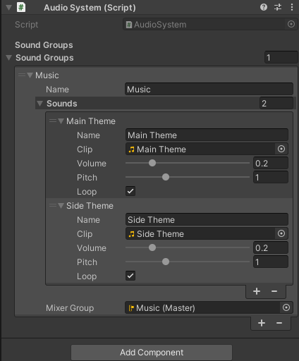

# Audio System

## Requirements
- `Utilities` package

## Setup
- Create a new empty GameObject called `Audio System`.
- Add the `AudioSystem.cs` component to the created GameObject.

## Adding New Sounds:
1. Add new `Sound Group` in the `Audio System` and give it unique name.
2. Add `Sounds` with unique names and audio clips.
3. Adjust `Volume`, `Pitch`, and `Loop` settings.

## Example


## Usage
- To play a **specific sound**, utilize `PlaySoundFromGroup("<Sound Group Name>", "<Sound Name>")` function
    ```csharp
    AudioSystem.Instance.PlaySoundFromGroup("<Sound Group Name>", "<Sound Name>");
    ```

- To play a **specific sound, but not if it isn't already playing**, utilize `PlaySoundFromGroupIfNotPlaying("<Sound Group Name>", "<Sound Name>")` function
    ```csharp
    AudioSystem.Instance.PlaySoundFromGroupIfNotPlaying("<Sound Group Name>", "<Sound Name>");
    ```

- To play a **random sound** from grup, utilize `PlayRandomSoundFromGroup("<Sound Group Name>")` function
    ```csharp
    AudioSystem.Instance.PlayRandomSoundFromGroup("<Sound Group Name>");
    ```

- To **stop a sound from playing**, utilize `StopPlaying("<Sound Group Name>", "<Sound Name>")` function
    ```csharp
    AudioSystem.Instance.StopSound("<Sound Group Name>");
    ```