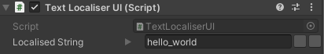

# Localisation System

### Solution originally made by **Game Dev Guide**, smaller or bigger changes might be applied

## Setup
### File Path:
- Store all localisation texts in the file located at
<br>`Resources/Localisation/localisation.csv`

### Formatting Rules:
- The first row of the file should adhere to the format
<br>`"key","<language tag>","<langugage tag2>",...`
- Subsequent lines must have the same number of values as the first line.
- Enclose each value in double quotes `""`
- Separate each value with a comma `,`
- Values requiring multiple lines, use the `<br>` tag instead of `\n` for a normal line break.

## Customization Options:
- You have the flexibility to customize parameters such as file path, line separator, and value separator.
    - Change them in `LocalisationCSVLoader.csv`

### Adding New Language:
- CSV File
    1. Add the language tag to the first row of the file, and ensure all subsequent rows contain the localised strings corresponding to that language tag.
- `LocalisationSystem.cs`
    1. Add the new language to the `Language Enum`
    2. Insert a new line into the `UpdateDictionaries()` function
        ```cs=41
        // ...
        UpdateSingleLanguage(<Enum Language Value>, "<CSV Language Tag>");
        ```

### Example
Source: `Resources/Localisation/localisation.csv`
```
"key","en","pl"
"hello_world","Hello World!","Witaj Świecie!"
"multiline_string","Multiline<br>String","Wielowierszowy<br>Ciąg Znaków"
```

## Usage

### TextMeshProUGUI
- To localise TextMeshProUGUI texts, add the `TextLocaliserUI` component to the text GameObject. Then, fill the `Localised String Tag` field with the corresponding key from the localisation file. Text will automatically be updated, whenever the current language changes.

### Dynamic Text (via Script)
- If you're dynamically setting the text during runtime, utilize the `LocalisationSystem.cs` class and its `GetLocalisedValue(string key)` function. This function retrieves the localised text based on the currently set language.

- **Example**
    - 
    -   ```cs=9
        _someText.SetText(LocalisationSystem.GetLocalisedValue("hello_world"));
        
        // or
        
        string localisedText = new LocalisationString("hello_world").value;
        _someText.SetText(localisedText);
        ```

### Changing Language in Runtime
- To change current language, utilize the `LocalisationSystem.cs` class and its `ChangeLanguage(<Enum Language Value>)` funtion.

- **Example**
    -   ```cs=9
        LocalisationSystem.ChangeLanguage(Language.English);
        ```